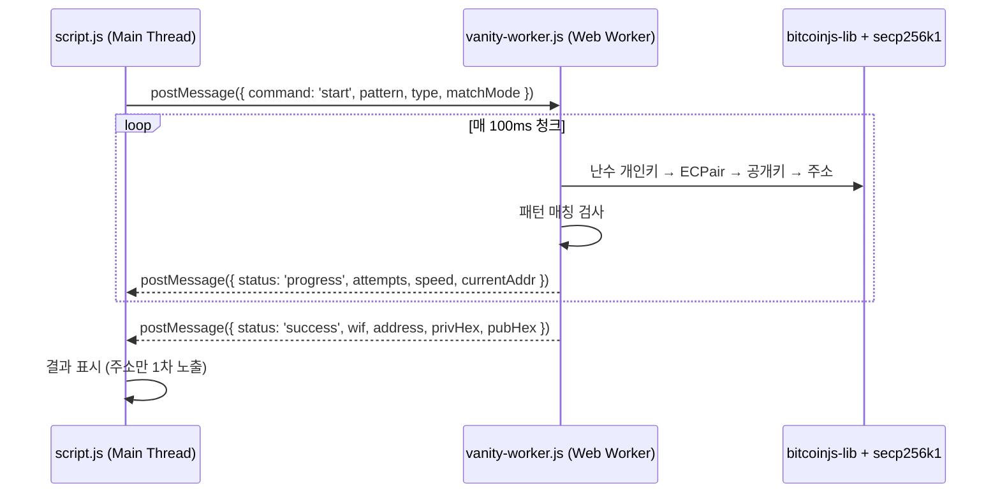

# Bitcoin Vanity Address Generator — 개발 문서

## 1. 프로젝트 개요

| 항목 | 내용 |
|------|------|
| **서비스명** | Bitcoin Vanity Address Generator |
| **목적** | 사용자가 원하는 패턴의 비트코인 주소를 브라우저에서 로컬 탐색 |
| **아키텍처** | 클라이언트 로컬 생성형 (서버 미전송) |
| **기술 스택** | HTML5 + Vanilla CSS + JavaScript (Web Worker) |
| **외부 라이브러리** | bitcoinjs-lib, noble-secp256k1, bech32/bech32m, CryptoJS |
| **최종 수정** | 2026-03-22 |

---

## 2. 파일 구조

```
test_page/
├── index.html           # 메인 페이지 (단일 페이지)
├── style.css            # 프리미엄 UI 스타일
├── script.js            # 메인 로직 (UI 제어, 입력 검증, Worker 통신)
├── vanity-worker.js     # Web Worker (주소 생성 + 패턴 매칭)
├── buffer.js            # Buffer shim (bitcoinjs-lib 호환)
├── bitcoinjs-lib.min.js # 비트코인 주소 생성 라이브러리
├── secp256k1.js         # noble-secp256k1 (ECDSA/Schnorr)
├── bech32.js            # Bech32/Bech32m 인코딩
├── crypto-js.min.js     # SHA-256 해시 (Taproot tagged hash)
└── bitcoinjs-lib-v6.js  # (미사용, 레거시 참조)
```

---

## 3. 지원 주소 타입

| 타입 | 접두사 | 인코딩 | 대소문자 | 구현 방식 |
|------|--------|--------|----------|-----------|
| **Legacy (P2PKH)** | `1` | Base58Check | 구분 | `bitcoin.payments.p2pkh` |
| **P2SH** | `3` | Base58Check | 구분 | `bitcoin.payments.p2sh({ redeem: p2wpkh })` |
| **Bech32 (P2WPKH)** | `bc1q` | Bech32 (BIP-173) | 소문자 | `bitcoin.payments.p2wpkh` |
| **Taproot (P2TR)** | `bc1p` | Bech32m (BIP-350) | 소문자 | 수동 BIP-341 구현 또는 `bitcoin.payments.p2tr` |

---

## 4. 핵심 아키텍처



### 4-1. 생성 흐름

1. `crypto.getRandomValues()` → 32바이트 난수 생성
2. `bitcoin.ECPair.fromPrivateKey(Buffer)` → 키페어 생성
3. 타입별 주소 파생 (P2PKH / P2SH / P2WPKH / P2TR)
4. 패턴 매칭 검사 (prefix 또는 contains)
5. 일치 시 결과 반환, 불일치 시 1로 반복

### 4-2. Worker 메시지 프로토콜

| 방향 | Command | 설명 |
|------|---------|------|
| UI → Worker | `start` | 탐색 시작 (`pattern`, `type`, `matchMode` 포함) |
| UI → Worker | `pause` | 일시정지 |
| UI → Worker | `resume` | 재개 |
| UI → Worker | `stop` | 중지 |
| Worker → UI | `progress` | 진행 상태 (`attempts`, `speed`, `currentAddr`) |
| Worker → UI | `success` | 매칭 성공 (`wif`, `address`, `privHex`, `pubHex`, `attempts`) |
| Worker → UI | `error` | 오류 발생 (`message`, `details`) |

---

## 5. 주요 모듈 설명

### 5-1. `script.js` — 메인 컨트롤러

| 기능 | 구현 상세 |
|------|-----------|
| **주소 타입 선택** | `.type-card` 클릭 → `selectedType` 변경 → 입력 검증 규칙 갱신 |
| **입력 검증** | Base58: `0OIl` 금지 / Bech32: 소문자 정규화 + 허용 문자 검사 |
| **난이도 계산** | `charsetSize^patternLength` → 6단계 분류 + 예상 시간 산출 |
| **Worker 통신** | `new Worker('vanity-worker.js')` → `onmessage` 핸들러 |
| **보안 모달** | 개인키 보기 클릭 → 경고 모달 → 확인 후 WIF/hex/pubkey 노출 |
| **다운로드** | Blob → `URL.createObjectURL` → `<a>` 자동 클릭 |

### 5-2. `vanity-worker.js` — 연산 엔진

| 기능 | 구현 상세 |
|------|-----------|
| **라이브러리 동적 로드** | `fetch` + `eval`로 buffer → bitcoinjs → CryptoJS → secp256k1 → bech32 순서 |
| **Taproot 수동 구현** | x-only pubkey + TapTweak tagged hash + `secp.Point.add` → Bech32m |
| **일시정지** | `isPaused` 플래그 → `setTimeout(searchChunk, 200)` 대기 루프 |
| **성능 최적화** | 100ms 청크 단위 연산, 청크마다 progress 보고 |

### 5-3. `buffer.js` — Buffer Shim

`bitcoinjs-lib`는 Node.js `Buffer`를 기대합니다. 브라우저에서는 `Uint8Array`를 래핑하여 다음 메서드를 구현합니다:

- `Buffer.from(data, encoding)` — hex, base64, utf8
- `Buffer.alloc(size)`, `Buffer.concat(list)`
- `toString('hex')`, `slice()`, `copy()`, `equals()`, `compare()`
- `readUInt8`, `writeUInt8`, `readUInt32BE`, `writeUInt32BE`

---

## 6. 입력 검증 정책

### Base58 (Legacy / P2SH)
```
허용: 123456789ABCDEFGHJKLMNPQRSTUVWXYZabcdefghijkmnopqrstuvwxyz
금지: 0, O, I, l (혼동 문자)
대소문자: 구분
```

### Bech32 / Bech32m (P2WPKH / P2TR)
```
허용: qpzry9x8gf2tvdw0s3jn54khce6mua7l
처리: 대문자 입력 시 자동 소문자 정규화
대소문자: 무시 (소문자 기준)
```

---

## 7. 난이도 계산 로직

```javascript
// Prefix 모드
expectedAttempts = charsetSize ^ patternLength

// Contains 모드 (주소 내 어딘가에 포함)
expectedAttempts = charsetSize ^ patternLength / addressLength
```

| 예상 시도 수 | 난이도 | CSS 클래스 |
|-------------|--------|-----------|
| ≤ 32 | 매우 쉬움 | `very-easy` |
| ≤ 1,024 | 쉬움 | `easy` |
| ≤ 100,000 | 보통 | `medium` |
| ≤ 10,000,000 | 어려움 | `hard` |
| ≤ 1,000,000,000 | 매우 어려움 | `very-hard` |
| > 1,000,000,000 | 비현실적 | `impossible` |

---

## 8. 보안 설계

| 원칙 | 구현 |
|------|------|
| **개인키 서버 미전송** | 모든 연산이 Web Worker 내부에서 실행 |
| **개인키 숨김 처리** | 결과에서 주소만 1차 표시 → 모달 경고 후 노출 |
| **메모리 정리** | "메모리 정리" 버튼 → 모든 결과 변수 null + UI 초기화 |
| **CSPRNG 사용** | `crypto.getRandomValues()` 우선, fallback으로 `Math.random()` |
| **다운로드 보안** | Blob → 일회성 URL → 즉시 revoke |

### 보안 경고 문구
- ⚠️ 이 개인키를 잃어버리면 주소를 다시 사용할 수 없습니다.
- ⚠️ 개인키를 다른 사람과 공유하면 자산 통제권도 함께 넘어갑니다.
- ⚠️ 공용 PC에서는 사용하지 마세요.

---

## 9. 결과 출력 형식

### TXT
```
Bitcoin Vanity Address Generator - 결과
==================================================
주소: 1ARD7vGgXZQJ1ZJS6iXHCDEevY9iDuouuH
개인키 (WIF): 5K...
개인키 (Hex): a1b2c3...
공개키 (Hex): 02a1b2c3...
총 시도: 26
소요 시간: 0초
```

### JSON
```json
{
  "network": "bitcoin-mainnet",
  "addressType": "p2pkh",
  "address": "1ARD7vGg...",
  "privateKeyWIF": "5K...",
  "privateKeyHex": "a1b2c3...",
  "publicKeyHex": "02a1b2c3...",
  "attempts": 26,
  "elapsedMs": 194,
  "avgSpeed": 134,
  "generatedAt": "2026-03-22T02:30:00Z",
  "matchMode": "prefix",
  "pattern": "A"
}
```

---

## 10. 브라우저 호환성

| 기능 | 최소 지원 |
|------|----------|
| Web Worker | Chrome 4+, Firefox 3.5+, Edge 12+ |
| `crypto.getRandomValues` | Chrome 11+, Firefox 21+ |
| `Proxy` | Chrome 49+, Firefox 18+ |
| `BigInt` (secp256k1) | Chrome 67+, Firefox 68+ |
| `backdrop-filter` (CSS) | Chrome 76+, Firefox 103+ |

> **권장 브라우저**: Chrome 80+ 또는 Firefox 80+

---

## 11. 성능 참고

| 환경 | 예상 속도 |
|------|----------|
| 데스크톱 Chrome (i7) | ~100,000–200,000 keys/s |
| 모바일 Chrome | ~20,000–50,000 keys/s |
| 저사양 PC | ~10,000–50,000 keys/s |

> Taproot(P2TR)은 수동 TapTweak 계산으로 인해 다른 타입 대비 2~5배 느립니다.

---

## 12. 향후 확장 방향 (MVP 이후)

- [ ] 다중 Worker 스레드로 병렬 탐색 (`navigator.hardwareConcurrency`)
- [ ] Suffix Match, Exact Pattern Window 지원
- [ ] 암호화 ZIP 다운로드 (AES-256)
- [ ] 작업 저장/복원 (IndexedDB)
- [ ] 모바일 터치 최적화
- [ ] 성능 벤치마크 리포트 자동 생성
- [ ] 서버 생성형 옵션 (기업용, 별도 분리)
